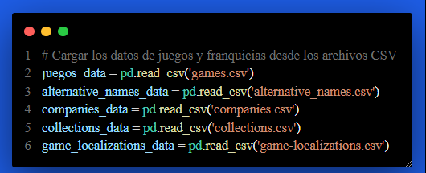

# Proyecto 1 - Grupo 24

<p>UNIVERSIDAD DE SAN CARLOS DE GUATEMALA</p>
<p>FACULTAD DE INGENIERIA</p>
<p>ESCUELA DE CIENCIAS Y SISTEMAS</p>
<p>BASES DE DATOS 2</p>
<p>SEGUNDO SEMESTRE 2023</p>

---

---

---

---

---

---

---

<div align="center">
<a href="https://git.io/typing-svg"></a>
</div>

---

---

---

---

## INTEGRANTES

|  Carnet   |        Nombre Completo        |
| :-------: | :---------------------------: |
| 202000194 |  Alvaro Emmanuel Socop Pérez  |
| 202001534 | Erwin Fernando Vasquez Peñate |
| 202000119 | Sergie Daniel Arizandieta Yol |

---

---

---

---

# <a name="nothing"></a>Carga de Datos

El proceso se realizó mediante una API en Python que utiliza archivos CSV preexistentes. Se realizaron pasos de filtración y generación de un archivo JSON. Además, se aplicó concurrencia y recursión para buscar elementos de listas y agregarlos al JSON. Finalmente, se ejecutó un comando para cargar los datos en un nuevo conjunto llamado "games". A continuación, se describen en detalle los pasos seguidos:

## Paso 1: Creación de la API en Python

### 1.1. Python Setup

Se configuro el entorno de python y se ha creado el archivo `create-jsongames.py`.

## Paso 2: Utilización de Archivos CSV

**Paso 2.1: Preparación de Datos**
Se utilizaron archivos CSV previamente preparados que contienen los datos que se desean cargar en MongoDB.


## Paso 3: Proceso de Filtración

Paso 3.1: Filtración de Datos
Se implementó un proceso de filtración para seleccionar los datos relevantes de los archivos CSV. Esto incluyó la eliminación de columnas innecesarias y la aplicación de lógica de filtrado según fuera necesario.

se cargaron los CSV:



se ha recorrido la lista de games del archivo CSV:


Se realizo el proceso de tomar cada uno de los archivos y buscar su informacion en cada uno de los CSV de las listas del archivo Games:


Por cada atributo se tomo la informacion de los CSV como fuera necesario:


Se ha realizado el proceso de limpieza de datos:


De ultimo se guardo el JSON en un archivo:


## Paso 4: Generación del Archivo JSON

**Paso 4.1: Creación del Archivo JSON**

Utilizando Python, se generó un archivo JSON que contiene los datos filtrados. La biblioteca json de Python se utilizó para esta tarea.

**Paso 4.2: Definición de la Estructura del JSON**

El JSON generado se diseñó de manera que refleje la estructura deseada de los documentos en MongoDB.

```JSON
{
    "id": 122229,
    "alternative_names": [
        {
            "id": 88946,
            "comment": "Japanese title - original",
            "name": "\u30b9\u30fc\u30d1\u30fc\u30ab\u30fc\u30d3\u30a3\u30cf\u30f3\u30bf\u30fc\u30ba"
        },
        {
            "id": 88948,
            "comment": "Japanese title - translated",
            "name": "Super Kirby Hunters"
        },
        {
            "id": 88974,
            "comment": "Japanese title - romanization",
            "name": "Super Kirby Hunters"
        },
        {
            "id": 95773,
            "comment": "Korean title",
            "name": "\uc288\ud37c \ucee4\ube44 \ud5cc\ud130\uc988"
        }
    ],
    "collection": [
        {
            "id": 7271,
            "name": "Kirby Clash",
            "url": "https://www.igdb.com/collections/kirby-clash"
        }
    ],
    "first_release_date": 1567555200.0,
    "franchises": [
        {
            "id": 789,
            "name": "Kirby"
        }
    ],
    "game_localizations": [
        {
            "id": 12183,
            "name": "\u30b9\u30fc\u30d1\u30fc\u30ab\u30fc\u30d3\u30a3\u30cf\u30f3\u30bf\u30fc\u30ba",
            "region": 3
        },
        {
            "id": 20983,
            "name": "\uc288\ud37c \ucee4\ube44 \ud5cc\ud130\uc988",
            "region": 2
        }
    ],
    "game_modes": [
        {
            "id": 1,
            "name": "Single player"
        },
        {
            "id": 2,
            "name": "Multiplayer"
        },
        {
            "id": 3,
            "name": "Co-operative"
        }
    ],
    "genres": [
        {
            "id": 31,
            "name": "Adventure"
        },
        {
            "id": 33,
            "name": "Arcade"
        }
    ],
    "involved_companies": [
        {
            "id": 95390,
            "company": [
                {
                    "id": 70,
                    "description": "Nintendo is a multinational corporation located in Kyoto  Japan. Founded by Fusajiro Yamauchi  it first produced handmade hanafuda cards and also tried several small niche businesses such as a cab company and a love hotel. Nintendo developed into a video game company  becoming one of the most influential in the industry and Japan s third most valuable listed company. The name Nintendo translated from Japanese to English means  Leave luck to Heaven .",
                    "name": "Nintendo",
                    "url": "https://www.igdb.com/companies/nintendo"
                }
            ]
        },
        {
            "id": 171431,
            "company": [
                {
                    "id": 762,
                    "description": "HAL Laboratory is a Japanese game developer partnered with Nintendo. It was founded by a small group of friends who shared the desire to create games  and among said group was Satoru Iwata. The group developed games for numerous platforms at first before developing exclusively for Nintendo. The name HAL originates from the fictional computer HAL 9000 from 2001: A Space Odyssey  as well as each letter being one letter before IBM. HAL Laboratory is most notable for developing the Kirby series created by ex-employee Masahiro Sakurai  they are also responsible for the Super Smash Bros. and the EarthBound series.",
                    "name": "HAL Laboratory",
                    "url": "https://www.igdb.com/companies/hal-laboratory"
                }
            ]
        },
        {
            "id": 171432,
            "company": [
                {
                    "id": 1759,
                    "name": "Vanpool",
                    "url": "https://www.igdb.com/companies/vanpool"
                }
            ]
        }
    ],
    "language_supports": [
        {
            "id": 498276,
            "language": [
                {
                    "id": 2,
                    "locale": "zh-CN",
                    "name": "Chinese (Simplified)",
                    "native_name": "\u7b80\u4f53\u4e2d\u6587"
                }
            ]
        },
        {
            "id": 498277,
            "language": [
                {
                    "id": 6,
                    "locale": "nl-NL",
                    "name": "Dutch",
                    "native_name": "Nederlands"
                }
            ]
        },
        {
            "id": 498279,
            "language": [
                {
                    "id": 7,
                    "locale": "en-US",
                    "name": "English",
                    "native_name": "English (US)"
                }
            ]
        },
        {
            "id": 498280,
            "language": [
                {
                    "id": 12,
                    "locale": "fr-FR",
                    "name": "French",
                    "native_name": "Fran\u00e7ais"
                }
            ]
        },
        {
            "id": 498281,
            "language": [
                {
                    "id": 15,
                    "locale": "it-IT",
                    "name": "Italian",
                    "native_name": "Italiano"
                }
            ]
        },
        {
            "id": 498283,
            "language": [
                {
                    "id": 16,
                    "locale": "ja-JP",
                    "name": "Japanese",
                    "native_name": "\u65e5\u672c\u8a9e"
                }
            ]
        },
        {
            "id": 498284,
            "language": [
                {
                    "id": 17,
                    "locale": "ko-KR",
                    "name": "Korean",
                    "native_name": "\ud55c\uad6d\uc5b4"
                }
            ]
        },
        {
            "id": 498286,
            "language": [
                {
                    "id": 9,
                    "locale": "es-ES",
                    "name": "Spanish (Spain)",
                    "native_name": "Espa\u00f1ol (Espa\u00f1a)"
                }
            ]
        }
    ],
    "name": "Super Kirby Clash",
    "platforms": [
        {
            "id": 130,
            "abbreviation": "Switch",
            "alternative_name": "NX",
            "name": "Nintendo Switch"
        }
    ],
    "player_perspectives": [
        {
            "id": 4,
            "name": "Side view"
        }
    ],
    "rating": 50.974985002304,
    "rating_count": 6.0,
    "release_dates": [
        {
            "id": 359481,
            "human": "Sep 04, 2019"
        },
        {
            "id": 359482,
            "human": "Sep 05, 2019"
        },
        {
            "id": 359483,
            "human": "Sep 05, 2019"
        }
    ],
    "storyline": "Long  long ago  in a faraway realm  there was a beautiful  peaceful land called the Dream Kingdom..",
    "summary": "Power through bosses on a team of four!  To defeat bosses this wicked  it\u2019ll take a whole team of Kirbys! In this free-to-start multiplayer a.",
    "themes": [
        {
            "id": 1,
            "name": "Action"
        }
    ],
    "url": "https://www.igdb.com/games/super-kirby-clash"
}


```

## Paso 5: Concurrencia y Recursión

Paso 5.1: Recursión
Se aplicó la recursión para recorrer las listas anidadas y agregar cada elemento al JSON resultante. Se prestaron especial atención al manejo de estructuras de datos recursivas.


## Paso 6: Carga de Datos en MongoDB

Paso 6.1: Conexión a MongoDB
Se configuró la conexión a una instancia de MongoDB en ejecución utilizando la biblioteca pymongo en la API Python.


Paso 6.2: Inserción Masiva (Bulk Insert)
La carga de datos se llevó a cabo mediante el uso del comando de inserción masiva (bulk insert) de MongoDB. Esto permitió una inserción eficiente de los datos en la base de datos.

```bash
mongoimport --uri "nuestraDB" --file 'E:\Users\PC\Downloads\CSV_fase2\rich_games_optimized.json' -d mongodbVSCodePlaygroundDB -c games --jsonArray --drop
```
